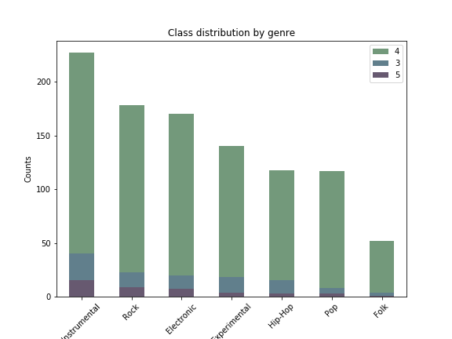
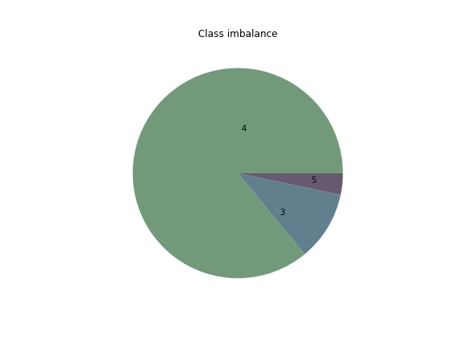

# classifying_time_signature_in_music

## About

### Goal
 
We are all familiar with the impulse of tapping along while vibing to a good song. For a given song, these beats are organized in groups allowing the song to have its structure. This structure is called 'Time signature'. It's common for a pop song to be in 4/4 time and for a waltz to have a time signature of 3/4.  

The goal of this project is to use machine learning to classify an audio sample's time signature by finding temporal patterns. Beyond an exercise in modelling a human response to a musical stimulus, this can be useful for a dj who wants to filter songs by the way we dance to it, or for music interaction systems which can search through a library of beats and apply a match for a given audio sample. 

<a href="https://docs.google.com/presentation/d/1fQJ5Gml8ZIHwERCDuqDwbLgfnvuWuyouvQpkRJrlMTQ/edit?usp=sharing">Google slides presentation</a>

### Files

#### Notebooks
- collecting_data
Retrieving necessary metadata for the "small" free music archive audio samples, and collecting time signature from Spotify.
- data_preparation_feature_engineering
Navigating paths to audio samples and transforming into features, then structuring dataframe for models.
- Modelling

#### Csv files
- clean_track_info.csv 
     track_fma_id,
     track_spot_id,
     time_signature,
     time_sig_confidence,
     tracks_id,
     track_name,
     artist_name,
     album_name,
     track_bit,
     track_top_genre
- final_df.csv
     track_id
     mfcc features
     target variable

## Data 

### Collection 

For the actual audio samples I downloaded 8000 30 second clips from 
<a href="https://os.unil.cloud.switch.ch/fma/fma_small.zip">fma_small.zip</a>.  The metadata for those files can be found at <a href="https://os.unil.cloud.switch.ch/fma/fma_metadata.zip">fma_metadata.zip</a>.  
I then used Spotify's API to search up these songs by three conditions, track name, artist name, and album name. I used <a href="https://pypi.org/project/fuzzywuzzy/ ">Fuzzy Wuzzy</a> to confirm that the search results were a match at over 66%. Out of 8000 samples I got accurate search results for 1419 of them. I then successfully collected the time signature for 1222 samples. After cleaning, my final dataset consisted of 
- 1034 in 4/4 time
- 128 in 3/4 time
- 42 in 5/4 time.

### Exploring

### Feature Engineering

For audio features I used Librosa to transform each sample into 20 Mel Frequency Cepstral Coefficients (MFCC).
I then took the mean for each coefficient vector for the length of sample and formed a DataFrame with the target variable being a class in time signature. 

## Modeling

### Class Imbalance
Baseline model scores an accuracy of 85% always classifying the majority class of 4/4 time.
Since I had a significant class imbalance I made use of SMOTE to upsample the two remaining classes of 3/4 and 5/4 time.

### Models

work in progress...

### Evaluation

work in progress...

## Future steps

work in progress...

## Permissions & Licenses

Audio files from FMA https://os.unil.cloud.switch.ch/fma/fma_small.zip
@inproceedings{fma_dataset,
  title = {{FMA}: A Dataset for Music Analysis},
  author = {Defferrard, Micha\"el and Benzi, Kirell and Vandergheynst, Pierre and Bresson, Xavier},
  booktitle = {18th International Society for Music Information Retrieval Conference (ISMIR)},
  year = {2017},
  archiveprefix = {arXiv},
  eprint = {1612.01840},
  url = {https://arxiv.org/abs/1612.01840},}

Thank you